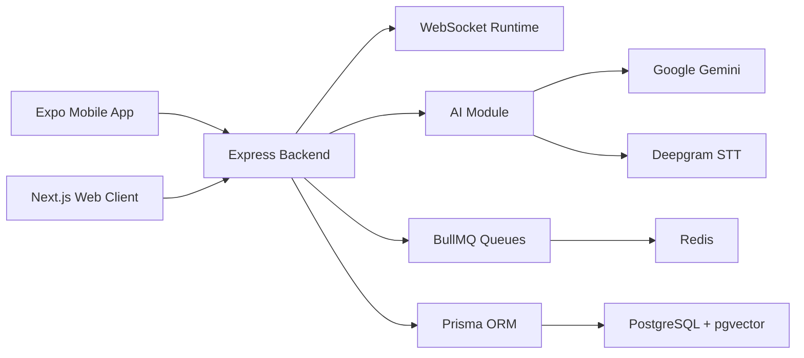

# EchoMind - Wearable AI Memory Assistant

## Overview

EchoMind is a wearable-first AI memory assistant for capturing spoken conversations, extracting structured memories, generating reminders, and enabling semantic recall through mobile and web interfaces.

The project was prepared for COM-811 Major Project submission by Group 8 under the supervision of Ms. Vani Malagar.

## Features

- Real-time mobile listening experience built with Expo and React Native.
- Web dashboard for memory vault, analytics, search, and backend sync status.
- Node.js and Express backend with REST APIs and WebSocket support.
- Gemini-powered memory extraction, reminder extraction, query answering, and summarization.
- Deepgram-based speech-to-text and diarization support.
- PostgreSQL schema managed by Prisma with pgvector-ready embedding storage.
- Redis and BullMQ support for background AI, embedding, notification, and dead-letter jobs.
- Optional Python context extraction service for future NLP expansion.
- Docker Compose setup for PostgreSQL, Redis, and local STT service.

## Architecture



Detailed architecture diagrams are available in [docs/architecture.md](docs/architecture.md).

## Technology Stack

- Mobile: React Native, Expo, Expo Router, NativeWind
- Web: Next.js, React, Tailwind CSS
- Backend: Node.js, Express.js, TypeScript, WebSockets
- Database: PostgreSQL, pgvector, Prisma
- Queue/cache: Redis, BullMQ
- AI/STT: Google Gemini, Deepgram
- Infrastructure: Docker, Docker Compose, Turborepo

## Installation

### Prerequisites

- Node.js >= 20
- npm
- PostgreSQL
- Redis
- Docker Desktop, recommended for local database and Redis
- Android Studio and Expo tooling for mobile builds

### Setup

```bash
npm install
```

Install mobile dependencies:

```bash
npm run mobile:install
```

### Environment Variables

```bash
cp .env.example .env
cp server/.env.example server/.env
```

For the web client, create `client/.env.local`:

```bash
NEXT_PUBLIC_API_URL=http://localhost:8080
NEXT_PUBLIC_BACKEND_URL=http://localhost:8080
NEXT_PUBLIC_WS_URL=ws://localhost:8080
```

For the mobile app, create `mobile/.env`:

```bash
EXPO_PUBLIC_API_URL=http://localhost:8080
EXPO_PUBLIC_WS_URL=ws://localhost:8080
EXPO_PUBLIC_ENABLE_PUSH_NOTIFICATIONS=false
EXPO_PUBLIC_GEMINI_API_KEY=replace_with_demo_key
```

### Database

Start local services:

```bash
docker compose up -d db redis
```

Run Prisma from the server workspace:

```bash
cd server
npx prisma generate
npx prisma migrate deploy
```

For local development migrations, use:

```bash
npm run db:migrate
```

### Run Backend

From the repository root:

```bash
npm run dev:server
```

Or from `server/`:

```bash
npm run dev
```

### Run Mobile

```bash
cd mobile
npx expo start
```

### Run Web

```bash
cd client
npm run dev
```

## Demo Instructions

1. Start PostgreSQL and Redis with `docker compose up -d db redis`.
2. Start the backend with `npm run dev:server`.
3. Start the web client with `npm run dev:client`.
4. Start the mobile app with `cd mobile && npx expo start`.
5. Use the doctor-patient demo scenario in [DEMO.md](DEMO.md).
6. Show memory extraction, reminder extraction, semantic search, and queryless reminder behavior.

## Documentation

- [SETUP.md](SETUP.md)
- [DEPLOYMENT.md](DEPLOYMENT.md)
- [DEMO.md](DEMO.md)
- [PROJECT_SUMMARY.md](PROJECT_SUMMARY.md)
- [FINAL_REPORT.md](FINAL_REPORT.md)
- [FINAL_AUDIT.md](FINAL_AUDIT.md)
- [SUBMISSION_CHECKLIST.md](SUBMISSION_CHECKLIST.md)
- [docs/architecture.md](docs/architecture.md)

## Team Members

- Aryan Manhas (2022A1R033)
- Gurparas Singh Dutta (2022A1R041)
- Adheesh Chopra (2022A1R043)
- Aarab Manhas (2022A1R044)

Supervisor: Ms. Vani Malagar
