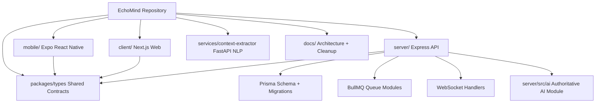
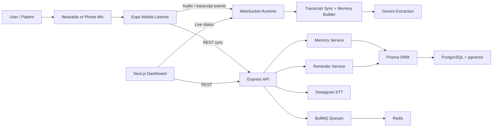
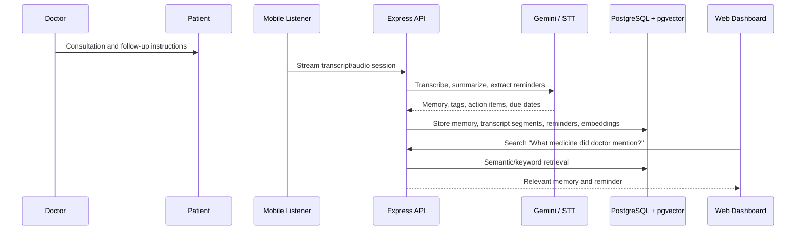
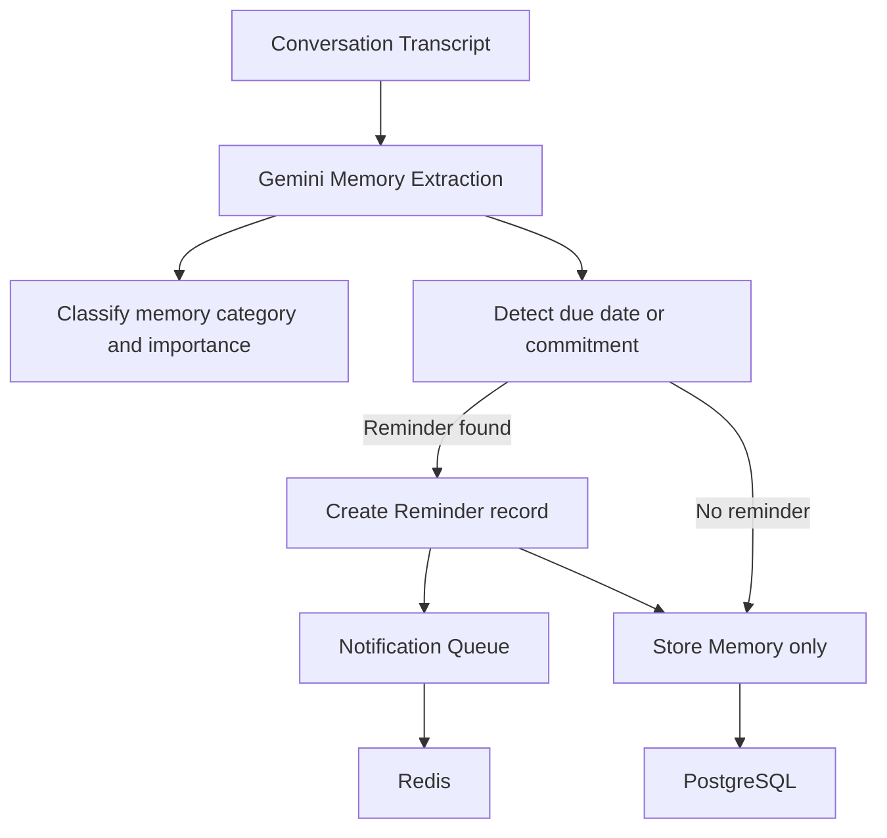
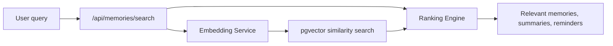
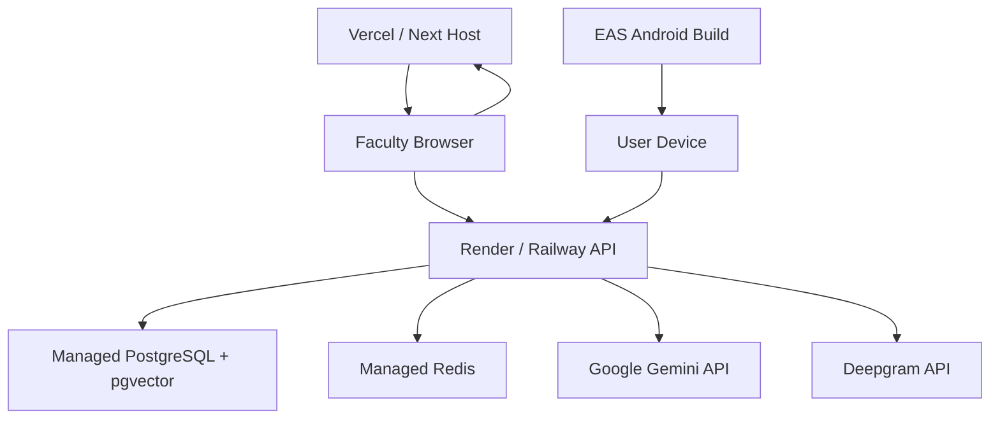
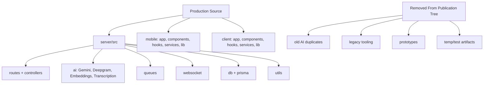

# EchoMind Architecture and Workflow Diagrams

## Repository Architecture

## Runtime System

## Doctor-Patient Demo Workflow

## Reminder Extraction Workflow

## Semantic Search Workflow

## Deployment Topology

## Clean Production Structure

